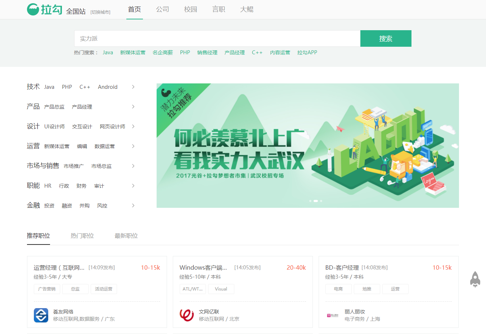
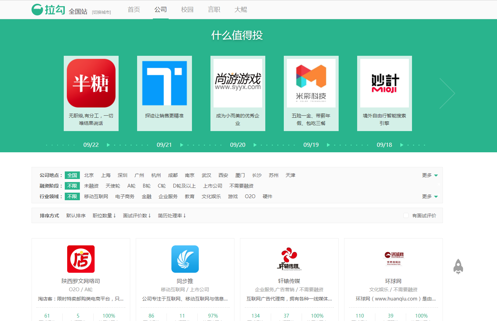
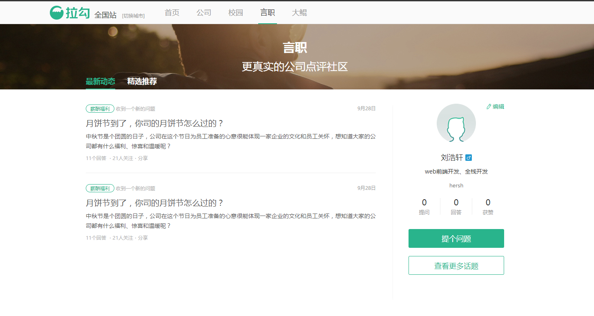

# 仿拉勾网

> 使用vue.js开发的仿拉勾网项目

## 组件

- [x] 首页
- [x] 公司
- [x] 校园
- [x] 言职
- [x] 轮播图
- [x] 图片横幅
- [x] 对话框
- [x] 筛选框
- [x] 卡片列表
- [x] 导航栏
- [x] 分页
- [x] 侧边栏
- [x] 工具栏

## 安装步骤

``` bash
# install dependencies
npm install

# serve with hot reload at localhost:8080
npm run dev

# build for production with minification
npm run build
``` 

## 项目截图







